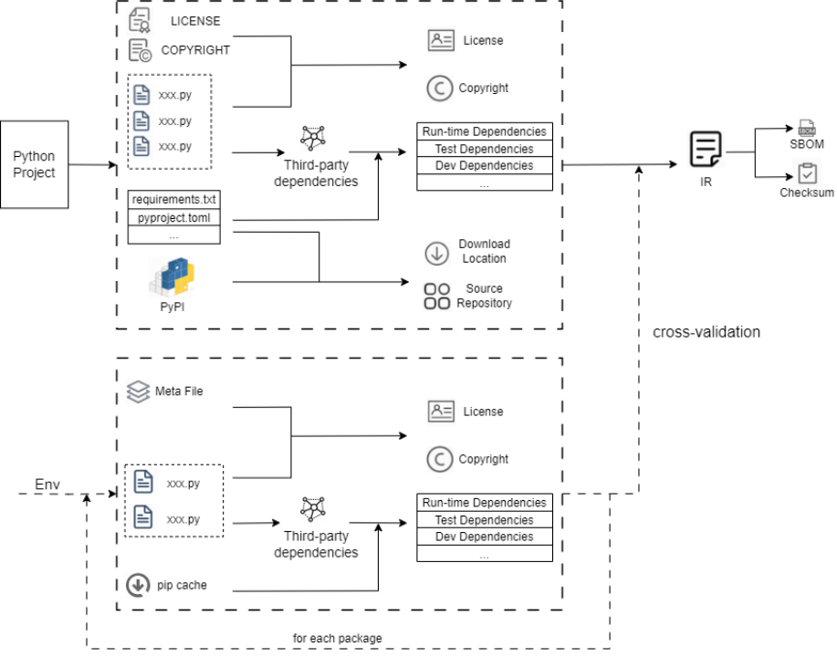

To address the widespread issues of inaccuracy, non-compliance, and incompleteness in the SBOMs generated by existing mainstream tools, we design and implement an automated SBOM generation tool based on incremental construction. 

The tool introduces an SBOM IR to unify and transform multiple SBOM standards during the generation process, employs schema validation to ensure output compliance, and applies a double cross-validation technique to enhance the precision and consistency of dependency identification. 

Experimental results demonstrate significant improvements in the accuracy, compliance, and completeness of generated SBOMs. 

🔧 SIT tool has now been integrated into platforms such as GitHub and AtomGit.

